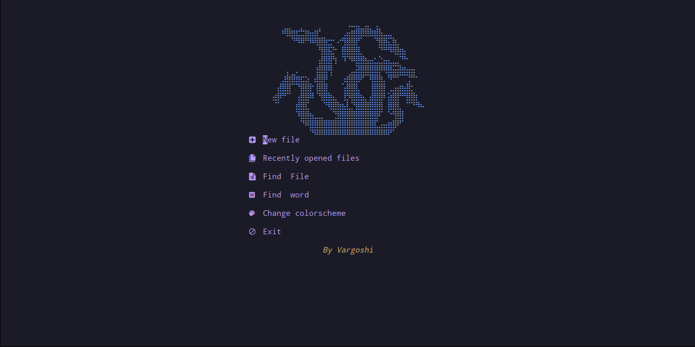
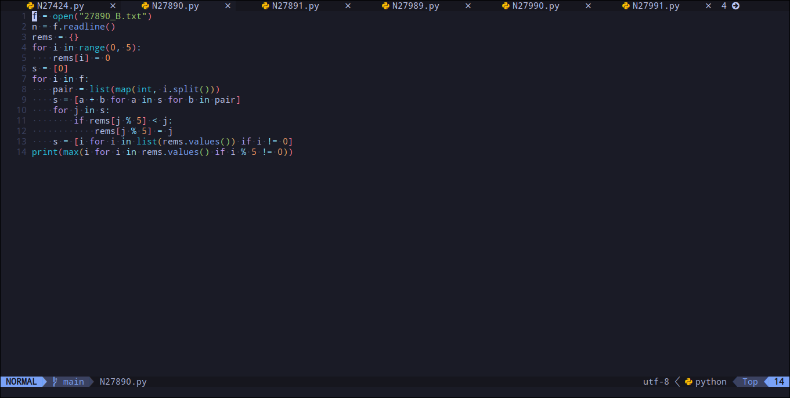
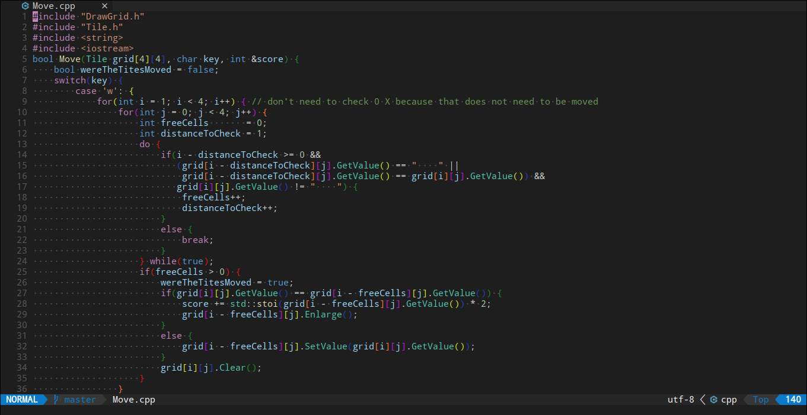
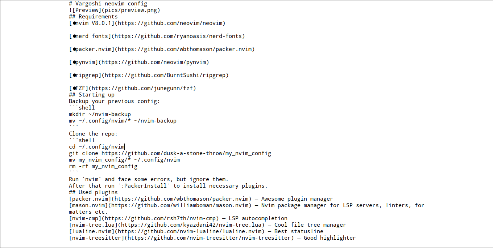

# Vargoshi neovim config
Main menu.

Tokyonight is the default theme.

Dark+ theme is preinstalled.

"Word Office" mode.

## Requirements
[:white_check_mark: nvim v0.9](https://github.com/neovim/neovim)

[:white_check_mark: git](https://git-scm.com/book/en/v2/Getting-Started-Installing-Git)

[:white_check_mark: nerd fonts](https://github.com/ryanoasis/nerd-fonts#option-3-install-script)

[:white_check_mark: packer.nvim](https://github.com/wbthomason/packer.nvim)

[:white_check_mark: pynvim](https://github.com/neovim/pynvim)

[:white_check_mark: ripgrep](https://github.com/BurntSushi/ripgrep)

[:white_check_mark: fzf](https://github.com/junegunn/fzf)

[:white_check_mark: bat](https://github.com/sharkdp/bat)

[:white_check_mark: lua](https://lua.org)
## Starting up
### Termux installation
**WARNING:** IT'S A BETA FEATURE. USE IT AT YOUR OWN RISK.  
Run:
```shell
bash -c "$(curl -s https://raw.githubusercontent.com/dusk-a-stone-throw/my_nvim_config/master/termux_install.sh)"
```
### Linux installation (may be used in Termux)
If you haven't installed packer.nvim yet, run this:  
```shell
git clone --depth 1 https://github.com/wbthomason/packer.nvim\
 ~/.local/share/nvim/site/pack/packer/start/packer.nvim
```
**WARNING:** If you are trying to install this in **Termux on Android 12+**, see [this](https://github.com/dusk-a-stone-throw/my_nvim_config/wiki/Termux-installation).  
Backup your previous config:  
```shell
mkdir ~/nvim-backup
mv ~/.config/nvim/* ~/nvim-backup
```
If you have hidden files inside, also run:
```shell
mv ~/.config/nvim/.* ~/nvim-backup
```
Clone the repo:  
```shell
git clone https://github.com/dusk-a-stone-throw/my_nvim_config ~/.config/nvim
```
Run `nvim` and face some errors, but ignore them.  
After that run `:PackerSync` to install necessary plugins and compile packer loader file for lazy load.  
*Remark: you probably will see **nvim-ts-rainbow** installation error, don't think about it. This plugin will be installed anyway.*  

After that restart `nvim` and setup LSP servers, themes, formatters etc.
### Windows installation
<!-- See [this page](https://github.com/dusk-a-stone-throw/my_nvim_config/wiki/Windows-installation). -->
Coming soon!
## Main used plugins
[packer.nvim](https://github.com/wbthomason/packer.nvim) — Awesome plugin manager  
[mason.nvim](https://github.com/williamboman/mason.nvim) — Nvim package manager for LSP servers, linters, formatters etc.  
[nvim-cmp](https://github.com/rsh7th/nvim-cmp) — LSP autocompletion  
[nvim-tree.lua](https://github.com/kyazdani42/nvim-tree.lua) — Cool file tree manager  
[lualine.nvim](https://github.com/nvim-lualine/lualine.nvim) — Best statusline  
[nvim-treesitter](https://github.com/nvim-treesitter/nvim-treesitter) — Good highlighter  
[bufferline.nvim](https://github.com/akinsho/bufferline.nvim) — Pretty bufferline  
[fterm.nvim](https://github.com/iajiawang/fterm.nvim) — Useful floating terminal  
[nvim-ufo](https://github.com/kevinhwang91/nvim-ufo) — Modern folding  
## Configuration
### LSP

Run `:Mason` to install LSP servers you need.  
For **Python** `pyright` is used by default (install it),
for **Lua** default is `lua_ls` (*lua-language-server*),
for **Cpp** `clangd` is default.  
To add a LSP server, you run `:Mason` and install all you need, then go to end of `LSP_config/nvim-cmp.lua` and add installed language server to the list *language_servers*:  
```lua
local language_servers = { 'lua_ls', 'clangd', 'pyright', '<YOUR LANGUAGE SERVER>' }
```
<details>
<summary>EXAMPLE INSTALLATION</summary>

#### Let's install a LSP server for Go.
1. Run `:MasonInstall gopls` (or run `:Mason` and choose manually).
2. Open `LSP_config/nvim-cmp.lua` and append **gopls** to the *language_servers*:  
from  
```lua
local language_servers = { 'lua_ls', 'clangd', 'pyright'}
```
to  
```lua
local language_servers = { 'lua_ls', 'clangd', 'pyright', 'gopls' }
```
*LSP autocompletion and linting are ready, but you better install a formatter and the Treesitter parser.*  
3. Run `:MasonInstall gofumpt` to install the formatter (or any other you need). Don't forget to configure it, see [Formatting](#Formatting).  
4. Install Treesitter parser: `:TSInstall go`.  
5. Here you *go*!
</details>

See [nvim-lspconfig](https://github.com/neovim/nvim-lspconfig), [configs](https://github.com/neovim/nvim-lspconfig/blob/master/doc/server_configurations.md),
[mason](https://github.com/williamboman/mason.nvim), and [mason-lspconfig](https://github.com/williamboman/mason-lspconfig.nvim)
### Snippets
[LuaSnip](https://github.com/L3MON4D3/LuaSnip) is used.  
#### Snippet collections
I prefer [honza/vim-snippets](https://github.com/honza/vim-snippets/tree/master/snippets),
but [rafamadriz/friendly-snippets](https://github.com/rafamadriz/friendly-snippets) is also preinstalled.  
I don't use them both because they provide some several *equal snippets*, but if it doesn't bother you, you may use them both:  
Open `LSP_config/nvim-cmp.lua` and uncomment this line:
```lua
require('luasnip.loaders.from_vscode').lazy_load()
```
For more info, see their docs.
### Formatting <a name="Formatting"></a>
**Python**, **C++** and **Lua** formatters are preconfigurated.  
(For **Python** you need [`yapf`](https://github.com/google/yapf) installed, for **C++** you need
[`clang-format`](https://clang.llvm.org/docs/ClangFormat.html),
for **Lua** you need [`stylua`](https://github.com/JohnnyMorganz/StyLua)).  
You may install them with `:Mason`.  
Open `plugins_config/null-ls.lua` and setup any formatter you need,
see [null-ls.nvim](https://github.com/jose-elias-alvarez/null-ls.nvim).
### Treesitter highlighting
**Python**, **C++** and **Lua** parsers will be installed at startup,
to install other ones you may run `:TSInstall <NAME>`.  
For configuration see `plugins_config/treesitter.lua`.
### Coderunner
**Java**, **Python**, **Typescript**, **Rust**, **C++** and **Bash** runners are preconfigurated,
to modify and add new runners, see `plugins_config/coderunner.lua`.  
Also see [code_runner.nvim](https://github.com/CRAG666/code_runner.nvim) for more information.
### Theme
Open `theme.lua` and change
```lua
vim.cmd [[ colorscheme tokyonight-night]]
```
to
```lua
vim.cmd [[ colorscheme COLORSCHEME_YOU_NEED]]
```
### Keymappings
Open `keymaps.lua` and add any keymapping you need by this syntax:
```lua
map({mode}, {lhs}, {rhs}, {opts})
```
For example:
```lua
map('n', '<C-Up>', ':MoveLine(-1)<CR>', { silent = true }) -- Move current line upwards
```
See [Offical docs](https://neovim.io/doc/user/lua.html#vim.keymap.set()).
### User commands
Open `commands.lua` and add any command you need.  
Syntax: 
```lua
vim.api.nvim_create_user_command({NAME}, {COMMAND}, {*OPTS})
```
Example:
```lua
vim.api.nvim_create_user_command('FTermToggle', 'lua require\'fterm\'.toggle()', {})
```
See [Offical docs](https://neovim.io/doc/user/api.html#nvim_create_user_command()) for help.
### Plugins config files
LSP plugins configs located in `LSP_config`.  
Other plugins configs located in `plugins_config`.
### Word Office mode (BETA)
To start "Word" mode, run `:WordModeEnable`,
To disable run `:WordModeDisable`.  
You can also center text in the middle of the screen, run `:WordModeCenter`.  
**Warning**: if you want to center text at the same time with the word mode, run `:WordModeEnable` first, then `:WordModeCenter`. *(some highlight troubles)*
### Customization
#### Dashboard
You can change Dashboard start ASCII-art, see [this collection](https://github.com/glepnir/dashboard-nvim/wiki/Ascii-Header-Text).  
Or make [your own header](https://xflea.github.io/nv-dashboard-header-maker/).  
Great thanks to [glepnir](https://github.com/glepnir) and [xflea](https://github.com/xflea) for that.

You can customoize and configure other plugins according their documentation.
